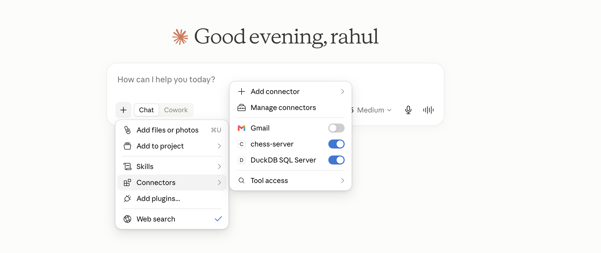

# DuckDB MCP Server



This project is a small Model Context Protocol (MCP) server that lets you query a DuckDB-based employee database through a simple tool interface. It is a beginner-friendly example for exploring how MCP servers work and how SQL can be exposed to AI assistants or local tools.

If you are new to this project, the best way to start is:
1. set up the environment,
2. seed the sample database,
3. run the MCP server locally,
4. try a few SQL queries.

## What this project does

The server exposes a single tool named `run_sql` that accepts a SQL statement and returns the result as a Markdown table. The sample database contains employee, department, salary, and attendance data so you can explore join queries and reporting-style SQL.

## Project files

- `duck_db_mcp.py` - the MCP server implementation
- `seed_employee_db.py` - creates and populates the DuckDB database
- `employee.duckdb` - the generated database file
- `pyproject.toml` - project dependencies
- `Makefile` - helper commands for setup

## Quick start

### 1. Create and activate a virtual environment

```bash
uv init
uv venv
```

### 2. Install dependencies

```bash
uv add "mcp[cli]" fastmcp duckdb pandas tabulate
```

### 3. Create the sample database

```bash
make setup-db
```

You can also run this directly:

```bash
python3 seed_employee_db.py
```

## Run the MCP server locally

### Test the server in development mode

```bash
mcp dev duck_db_mcp.py
```

Or with `uv`:

```bash
uv run mcp dev duck_db_mcp.py
```

### Install the MCP server

```bash
mcp install duck_db_mcp.py
```

## Start exploring

Once the server is running, try simple queries like these:

### Example: list employees and departments

```sql
SELECT
    e.first_name,
    e.last_name,
    d.department_name
FROM employee e
JOIN department d
    ON e.department_id = d.department_id
ORDER BY e.last_name;
```

### Example: view salary information

```sql
SELECT
    e.first_name,
    e.last_name,
    s.net_salary,
    s.pay_month
FROM employee e
JOIN salary s
    ON e.employee_id = s.employee_id
ORDER BY s.net_salary DESC;
```

### Example: employee attendance summary

```sql
SELECT
    e.first_name,
    e.last_name,
    a.attendance_date,
    a.status
FROM employee e
JOIN attendance a
    ON e.employee_id = a.employee_id
ORDER BY a.attendance_date, e.last_name;
```

## Claude Desktop MCP config

If you want to use this server from Claude Desktop, install it first:

```bash
mcp install duck_db_mcp.py
```

A typical configuration looks like this:

```json
{
  "DuckDB SQL Server": {
    "command": "/opt/homebrew/bin/uv",
    "args": [
      "run",
      "--frozen",
      "--with",
      "mcp[cli]",
      "mcp",
      "run",
      "/Users/rahulkumar/Desktop/AI/mcp_server_learning/duck_db_mcp/duck_db_mcp.py"
    ],
    "env": {
      "VIRTUAL_ENV": "/Users/rahulkumar/Desktop/AI/mcp_server_learning/duck_db_mcp/.venv",
      "PATH": "/Users/rahulkumar/Desktop/AI/mcp_server_learning/duck_db_mcp/.venv/bin:/opt/homebrew/bin:/usr/bin:/bin"
    }
  }
}
```

## Install from GitHub

If you want someone else to install this package directly from GitHub, use this command:

```bash
uvx --from git+https://github.com/panditrahulsharma/duck_db_mcp.git duck_mcp
```

For Claude Desktop, the config can look like this:

```json
{
  "mcpServers": {
    "DuckDB SQL Server": {
      "command": "uvx",
      "args": [
        "--from",
        "git+https://github.com/panditrahulsharma/duck_db_mcp.git",
        "duck_mcp"
      ]
    }
  }
}
```

Make sure the latest changes in [pyproject.toml](pyproject.toml) and [duck_db_mcp.py](duck_db_mcp.py) have been committed and pushed to GitHub before trying this install method.

## Git MCP config

If you also want to use Git-related MCP tools, you can add a Git MCP server configuration in the same client config. A typical example is:

```json

{
  "mcpServers": {

    "DuckDB SQL Server": {
      "command": "uvx",
      "args": [
        "--from",
        "git+https://github.com/panditrahulsharma/duck_db_mcp.git",
        "duck_mcp"
      ]
    }
  }
}

```

This is useful when you want your MCP client to access Git operations such as status, diff, branch, and commit history while working with this project.

## Notes for contributors

When adding or changing tools, make sure the docstring is clear and descriptive. A well-written docstring helps MCP clients understand what the tool does and how to use it correctly.
